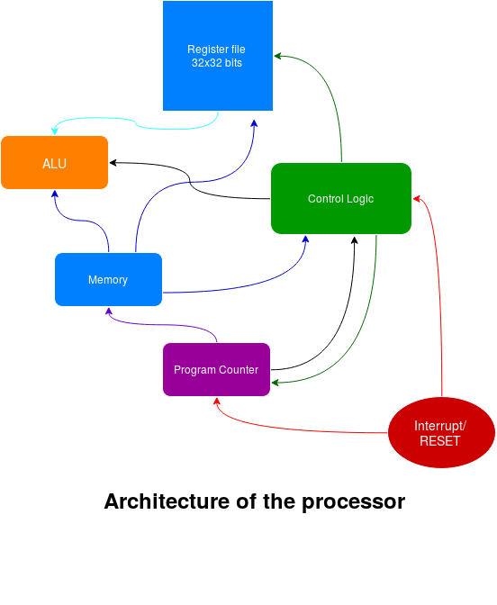

RISC processor
==============

This repository contains basic implementation of a 32-bit single core unpipelined RISC processor written in Verilog. This is a hobby project to understand how processors and operating systems work.  

Along with processor a simple assembler and disassembler written in python is also included. 

<p>
<a href="documentation/processorDiagram.png">
  
</a>   

Detailed schematic of the processor is available [here](documentation/schematic.pdf) in PDF format

Description
===========
Processor is based on very simple architecture described in MIT 6.004 (Computation structures). It supports 30 basic instructions. Processor can handle both synchronous and asynchronous interrupts and supports reset. It can operate in supervisor mode and user mode.

Memory  
------  
Memory is byte addressed where each byte is of 8 bit, but memory provides access to 4 bytes at a time thus each addressable memory location is 4 * 8 = 32 bits wide. Processor can address 2^32 = 4294967296 B of memory.  

Registers  
---------  
Processor supports 32, 32-bit wide registers (__r0-r31__) of which __r27-r30__ are reserved by hardware and R31 is always `0x00000000`. 

Modes of Operations
-------------------
__User Mode__  
User mode is represented by 0 in MSB of program counter. While processor is in user mode interrupts are caught and processor switches to supervisor mode pausing current operation.

__Supervisor Mode (Kernel mode)__  
Supervisor mode is represented by 1 in the MSB of PC. While processor is kernel mode interrupts are ignored. Some of the instructions (starting with 0x00) are available only in supervisor mode. 

User mode can call supervisor mode by executing an illegal opcode, Upon execution of an illegal opcode processor jumps to Address 0x00000008 memory location and saves current PC to XP (r27 register), and new PC is 0x80000008 where 8 denotes supervisor mode.

Instruction Set
---------------
Processor supports 30 basic instructions. All of the instructions available are 32 bit wide and are in one of the two formats:  
```<OP_code><RegAdd1><RegAdd2><RegAdd3><constant>```  
or  
```<OP_code><RegAdd1><RegAdd2><16BitLiteral>```

| Instruction | Description                                                                                                                                                       |
|-------------|-------------------------------------------------------------------------------------------------------------------------------------------------------------------|
| ADD         | Add content of reg1 to reg2 and store result in reg3                                                                                                              |
| ADDC        | Add content of reg1 to 16bit constant and store result in reg3                                                                                                    |
| SUB         | Subtract content of reg2 from reg1 and store result in reg3                                                                                                       |
| SUBC        | Subtract 16bit constant from contents of reg1 and store in reg3                                                                                                   |
| AND         | Bitwise AND contents of reg1, reg2 and store result in reg3                                                                                                       |
| ANDC        | Bitwise AND contents of reg1, sign extended 16bit constant and store result in reg3                                                                               |
| OR          | Bitwise OR contents of reg1, reg2 and store result in reg3                                                                                                        |
| ORC         | Bitwise OR contents of reg1, sign extended 16bit constant and store result in reg3                                                                                |
| XOR         | Bitwise XOR contents of reg1, reg2 and store result in reg3                                                                                                       |
| XORC        | Bitwise XOR contents of reg1, sign extended 16bit constant and store result in reg2                                                                               |
| BEQ/BNE     | Change PC to address releative to current PC (curPC - sign extended constant) and save current PC to reg3 if content of reg1 is equal to/ not equal to 0x00000000 |
| CMPLE       | Store 0x00000001 in reg3 if content of reg1 is smaller than or equal to reg2                                                                                      |
| CMPLEC      | Store 0x00000001 in reg2 if content of reg1 is smaller than or equal to sign extended 16bit constant                                                              |
| CMPEQ       | Store 0x00000001 in reg3 if content of reg1 is equal to reg2                                                                                                      |
| CMPEQC      | Store 0x00000001 in reg3 if content of reg1 is equal to sign extended 16bit constant                                                                              |
| CMPLT       | Store 0x00000001 in reg3 if content of reg1 is smaller than reg2                                                                                                  |
| CMPLTC      | Store 0x00000001 in reg3 if content of reg1 is less than sign extended 16bit constant                                                                             |
| LD          | load memory content at address sign extended constant + reg1 to reg3                                                                                              |
| LDR         | load memory content at address sign extended constant + current PC to reg3                                                                                        |
| MUL         | Multiply contents of reg1, reg2 and store it in reg3                                                                                                              |
| MULC        | Multiply content of reg1 with sign extended 16bit constant and store it in reg3                                                                                   |
| SHL/SHLC    | Shift left contents of reg1 by reg2/16bit sign extended constant and store it in reg3                                                                             |
| SHR/SHRC    | Shift right contents of reg1 by reg2/16bit sign extended constant and store it in reg3                                                                            |
| SRA/SRAC    | Shift right and pad with sign of reg1, contents of reg1 by reg2/16bit sign extended constant and store it in reg3/reg2                                            |
| ST          | Store contents of reg3 in memory location calculated by reg1 + 16bit sign extended constant                                                                       |
| JMP         | Change PC to address calculated by reg1&0xFFFFFFFC constant and store current address to reg3                                                                     |


Assembly Language
=================
A modified variant of at&t based assembly language is used where instructions are coded as:
`<Instruction> <space> <Register(s)/Label separated by comma>`

An example assembly code is:
```assembly
  ...
  ...
; First load each register with its
; number using only OP instructions

	AND %r31, %r31, %r0     ; AND 0x0, 0x0 and store it in %r0
	CMPEQ %r31, %r31, %r1   ; Store 0x1 in %r1 if %r31 == %r31
	ADD %r1, %r1, %r2       ; ...
	OR %r2, %r1, %r3
	SHL %r1, %r2, %r4
  ...
  ...
```

Verification
============
Different parts of processor have been verified using testbenches while complete processor is also verified using two programs written in custom assembly language. These program tests all the instructions, for IRQ and RESET two external signals are provided using TestBench.

Files for performing tests:
* Basic Test Memory [BasicTestMemory.v](sources/modules/BasicTestMemory.v)
* Branching Test Memory [BranchingTestMemory.v](sources/modules/BranchingTestMemory.v)

These are used by [ProcessorTestbench.v](sources/testbench/ProcessorTestbench.v)

Test Programs
=============
This repository also includes few test program that verifies behavior of processor  
* Basic test (ALU, PC, Memory and Register file) [[BasicTest.r.asm](tests/BasicTest.r.asm)]
* Advanced test (Branching, jump inst. and interrupts) [[BranchingTest.r.asm](tests/BasicTest.r.asm) description of test is [here](tests/BasicTest.r.asm)]

Example Programs
=============
- An example program is also provided which calculates value of 2 raised to the power of consecutive integer.  
[powers-of-two](examples/powers-of-two/README.md)  
- Example program for displaying values to a LCD(16x2).  
[simpleDisplay](examples/simple-display/README.md)

Assembler and Dissasembler
==========================
A very simple assembler (partially complete at [Assembler.py](resources/assembler.py)) and disassembler ([Disassembler.py](resources/disassembler.py))

TODOs
=====
- [ ] Complete assembler with support for macros
- [ ] Verify implementation using an FPGA  
- [ ] Increase performance by introducing pipelining  
- [ ] Write simple OS with drivers for VGA text mode

Contributor
===========
Suyash Mahar ([@suyashmahar](https://github.com/suyashmahar))

License
=======
RISC-Processor is licensed under MIT-license unless explicitly mentioned.
