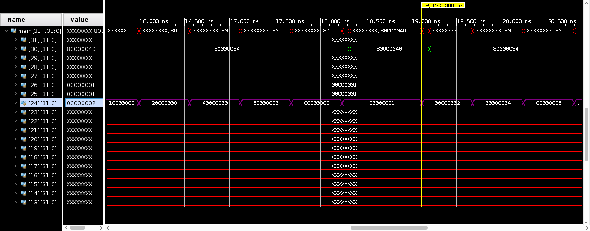

Powers Of Two Example
=====================
Powers of two is an example program that generates powers of 2 on each loop iteration. 

Source Files
------------
- Verilog module for memory | [PowerOfTwoMemory.v](PowerOfTwoMemory.v)
- Assembly program used | [powers-of-two.r.asm](powers-of-two.r.asm)
- Assembled program (binary) | [powers-of-two.bin](powers-of-two.bin)
- Assembled program (text) | [powers-of-two.bin.txt](powers-of-two.bin.txt)

Simulation Results
------------------
   
[Click to zoom] Simulation results for powers-of-two program, where result is stored in %r24 (highlighted in purple), on each loop
